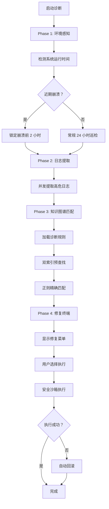

# AURORA Analyzer - Windows 事件日志导出与智能诊断工具

**版本:** V1.1.23.0  
**构建时间:** 2026.05.19  
**作者:** AURORA VelociRaptor-GR Dev PRJ.  
**许可:** 仅供个人学习与研究使用

---

## 📖 目录 / Table of Contents

1. [产品概述 / Product Overview](#-产品概述)
2. [核心功能 / Core Features](#-核心功能)
3. [系统架构 / System Architecture](#-系统架构)
4. [技术规格 / Technical Specifications](#-技术规格)
5. [快速开始 / Quick Start](#-快速开始)
6. [PRO 模式详解 / PRO Mode Guide](#-pro-模式详解)
7. [智能诊断引擎 / Smart Diagnostics Engine](#-智能诊断引擎)
8. [Phase 4.2 Undo 支持系统](#-phase-42-undo-支持系统)
9. [Phase 5 动画引擎](#-phase-5-动画引擎)
10. [开发者指南 / Developer Guide](#-开发者指南)
11. [常见问题 / FAQ](#-常见问题)
12. [版本历史 / Version History](#-版本历史)

---

## 📌 产品概述

AURORA Analyzer 是一款专业的 Windows 系统事件日志导出与智能诊断工具，集成了高级日志分析、知识库匹配、自主修复建议等强大功能。

### 主要特性

- **双语支持**: 完整的中文/英文双语界面
- **PRO 模式**: 专业级日志导出与分析
- **智能诊断**: 基于知识图谱的自动问题识别
- **安全修复**: 带系统还原点和快速备份的修复操作
- **现代 GUI**: 高性能 Windows Forms 图形界面
- **会话持久化**: 支持断点续传和进度保存

### 适用场景

- 系统故障排查与根源分析
- 蓝屏/意外关机问题诊断
- 驱动程序冲突检测
- 系统健康状态评估
- 企业 IT 运维自动化

---

## 🚀 核心功能

### 1. PRO 模式 - 高级日志导出

**支持日志类型:**
- System (系统日志)
- Application (应用程序日志)
- Security (安全日志) - 需管理员权限
- Setup (安装日志)
- DNS Server (DNS 服务器日志)
- DHCP Server (DHCP 服务器日志)
- Directory Service (Active Directory 日志)
- IIS Admin Service (IIS 服务器日志)

**导出模式:**
- 单日导出：快速导出指定日期的日志
- 日期范围导出：支持跨日期批量导出
- 自定义筛选：按 EventID、Provider、级别等条件过滤

### 2. 智能诊断引擎 (SmartEngine)

**核心能力:**
- 自动分析系统运行时间与崩溃历史
- 靶向锁定异常时间段（崩溃前 2 小时/启动后 4 小时）
- Minidump 蓝屏转储文件自动解析
- 知识图谱规则匹配（支持 100+ 诊断规则）
- 自主修复建议与一键执行

**诊断规则分类:**
- A 类：系统稳定性（意外关机、蓝屏）
- B 类：应用程序错误
- C 类：驱动程序问题
- D 类：硬件故障预警
- E 类：安全事件审计

### 3. 安全修复沙箱 (Phase 4.2)

**Undo 支持系统:**
- **系统还原点**: 使用 Windows System Restore API
- **快速备份快照**: 注册表/文件/服务配置的快速备份
- **修复会话日志**: 完整的修复操作审计追踪
- **一键撤销**: 支持修复操作的快速回滚

**安全执行流程:**
```
前置检查 → 创建还原点 → 创建备份快照 → 执行修复 → 验证结果 → (失败时自动回滚)
```

### 4. 现代 GUI 界面

**技术特性:**
- 无边框窗口设计 + 自定义拖拽
- Aurora 进度条（光晕动画 + 粒子系统）
- 星空背景状态面板
- 实时日志输出与进度显示
- 全息对话框交互

**性能分级:**
- Extreme (发烧级): 8 核 + 32G+
- Performance (性能级): 6 核 16G
- Balanced (均衡级): 4 核 8G
- Eco (节能级): 老旧设备

---

## 🏗️ 系统架构

### 目录结构

```
AURORA-Analyzer-Factory/
├── AURORA.Launcher-双击启动.exe    # 主启动器（免密码启动）
├── GAURORA.CHK.ENC                 # 加密验证文件
├── version.txt                     # 版本信息
├── desktop.ini                     # 文件夹美化配置
│
├── Scripts/                        # 核心脚本目录
│   ├── AURORA-AnalyzerLauncherGUI.ps1      # 主启动 GUI
│   ├── AURORA-AnalyzerPRO.ps1              # PRO 模式统一入口
│   ├── AURORA-AnalyzerCHSPRO.ps1           # 中文专业版引擎
│   ├── AURORA-AnalyzerENGPRO.ps1           # 英文专业版引擎
│   ├── AURORA-SmartEngine.ps1              # 智能诊断引擎
│   ├── AURORA-CoreEngine.ps1               # 共享核心引擎
│   ├── AURORA-GUI-Functions.ps1            # GUI 辅助函数
│   ├── AURORA-Language.psd1                # 双语资源包
│   ├── AURORA-ProgressManager.ps1          # 进度管理器
│   ├── AURORA-ProgressManager-Integration-CHS.ps1
│   ├── AURORA-ProgressManager-Integration-ENG.ps1
│   ├── AURORA-ProgressManager-Integration.ps1
│   │
│   ├── Phase 4.2 Undo 支持模块
│   ├── AURORA-RestoreManager.ps1           # 系统还原管理器
│   ├── AURORA-RepairLogger.ps1             # 修复日志记录器
│   ├── AURORA-UndoManager.ps1              # 快速备份与还原
│   ├── AURORA-RepairTools.ps1              # 修复工具入口
│   └── AURORA-UndoViewer.ps1               # Undo 管理器查看器
│   │
│   └── Core/
│       └── AURORA-AnimationCoreEngine.ps1  # 动画核心引擎
│
├── Data/                           # 数据目录
│   ├── AURORA-TechData.json        # 技术知识库（诊断规则）
│   └── AURORA-TechData.cache.clixml # 知识库缓存
│
├── Resources/                      # 资源目录
│   ├── AURORAICON.ico              # 应用程序图标
│   └── CascadiaMono.ttf            # 等宽字体（界面美化）
│
├── UserLogs/                       # 用户日志输出目录
│   └── *.csv, *.json, *.xml, *.txt # 导出的日志文件
│
└── build.ps1                       # PowerShell 构建脚本
    AURORA-build.bat                # 批处理构建工具
```

### 核心组件说明

| 组件名称 | 文件大小 | 用途描述 |
|---------|---------|---------|
| AURORA.Launcher-双击启动.exe | ~50KB | C# 编译的无窗口启动器，负责完整性验证 |
| AURORA-AnalyzerLauncherGUI.ps1 | ~10,000 行 | 主 GUI 界面，负责任务管理与用户交互 |
| AURORA-AnalyzerPRO.ps1 | ~200 行 | PRO 模式统一入口，根据语言参数分发 |
| AURORA-AnalyzerCHSPRO.ps1 | ~7,767 行 | 中文专业版日志导出引擎 |
| AURORA-AnalyzerENGPRO.ps1 | ~7,500 行 | 英文专业版日志导出引擎 |
| AURORA-SmartEngine.ps1 | ~1,500 行 | 智能诊断与自主修复引擎 |
| AURORA-CoreEngine.ps1 | ~500 行 | CHSPRO/ENGPRO 共享的核心功能 |
| AURORA-GUI-Functions.ps1 | ~220 行 | GUI 辅助函数（字体、目录检测等） |
| AURORA-AnimationCoreEngine.ps1 | ~800 行 | 动画渲染引擎（进度条、粒子系统） |

---

## 📊 技术规格

### 系统要求

**最低配置:**
- Windows 10/11 (64 位)
- PowerShell 5.1 或更高版本
- .NET Framework 4.0+
- 50MB 可用磁盘空间

**推荐配置:**
- Windows 11 (22H2 或更新)
- 8GB+ 内存
- 4 核 CPU
- SSD 存储

### 安全性

**加密验证:**
- AES-256-CBC 加密检查文件
- SHA256 文件完整性校验
- 密码强度策略（8 位 + 大小写 + 数字 + 特殊字符）

**权限管理:**
- 标准用户模式（默认）
- 管理员提权模式（Security 日志/系统还原）
- 交互式授权确认

### 性能指标

**日志导出速度:**
- System 日志（24 小时）：~5-10 秒
- Application 日志（24 小时）：~3-8 秒
- Security 日志（24 小时）：~10-20 秒

**智能诊断速度:**
- 知识图谱加载：~0.5-2 秒（缓存命中）
- 规则匹配：~1-3 秒（10 万条事件）
- Minidump 解析：~0.1-0.5 秒/文件

---

## 🎯 快速开始

### 方法 1: EXE 启动器（推荐）

```bash
# 双击运行
AURORA.Launcher-双击启动.exe
```

**优势:**
- 无需密码验证
- 自动完整性检查
- 隐藏 PowerShell 窗口

### 方法 2: PowerShell 直接启动

```powershell
# 进入项目根目录
cd AURORA-Analyzer-Factory

# 运行 GUI 脚本
.\Scripts\AURORA-AnalyzerLauncherGUI.ps1
```

**注意:** 直接运行需要输入启动密码（由构建者设置）

### 方法 3: 批处理构建工具

```batch
# 查看帮助
AURORA-build.bat /help

# 开始构建
AURORA-build.bat /generate
```

**功能:**
- 自动版本管理
- 密码强度检查
- 加密文件生成
- C# 启动器编译
- 自动 ZIP 打包

---

## 🔧 PRO 模式详解

### 使用流程

1. **选择日志类型**
   - 标准模式：System + Application（默认）
   - 扩展模式：Security/Setup/DNS/DHCP/AD/IIS

2. **选择日期范围**
   - 单日导出：快速导出指定日期
   - 日期范围：批量导出多天日志

3. **设置筛选条件**（可选）
   - EventID 筛选
   - Provider 筛选
   - 日志级别（Critical/Error/Warning）

4. **开始导出**
   - 自动生成 CSV + JSON + XML 格式
   - 生成摘要报告与趋势分析

### 输出文件

**主日志文件:**
- `系统_日志_YYYYMMDD___YYYYMMDD.csv` - CSV 格式
- `系统_日志_YYYYMMDD___YYYYMMDD.json` - JSON 格式
- `系统_日志_YYYYMMDD___YYYYMMDD.xml` - XML 格式
- `系统_日志_YYYYMMDD___YYYYMMDD_摘要.txt` - 文本摘要

**分析文件:**
- `系统_日志_YYYYMMDD_至_YYYYMMDD_趋势分析.txt` - 趋势分析报告
- `系统_日志_YYYYMMDD_至_YYYYMMDD_趋势数据.csv` - 趋势数据

---

## 🤖 智能诊断引擎

### 工作原理



### Minidump 解析

**支持的 BugCheck 代码:**
- 0x0000000A: IRQL_NOT_LESS_OR_EQUAL
- 0x0000001E: KMODE_EXCEPTION_NOT_HANDLED
- 0x0000003B: SYSTEM_SERVICE_EXCEPTION
- 0x0000007E: SYSTEM_THREAD_EXCEPTION_NOT_HANDLED
- 0x00000116: VIDEO_TDR_ERROR
- 0x00000124: WHEA_UNCORRECTABLE_ERROR
- 0x00000133: DPC_WATCHDOG_VIOLATION
- ... (支持 20+ 常见蓝屏代码)

**解析内容:**
- BugCheck 代码与参数
- 可能的故障原因
- 推荐解决方案

---

## 🔄 Phase 4.2 Undo 支持系统

### 系统还原点管理

**功能:**
- 创建系统还原点（Windows System Restore）
- 查询可用还原点列表
- 删除过时还原点
- 执行系统还原（需重启）

**API 调用:**
```powershell
# 创建还原点
Create-SystemRestorePoint -Description "AURORA Before Repair"

# 查询还原点
Get-SystemRestorePoints

# 删除还原点
Remove-SystemRestorePoint -SequenceNumber 45
```

### 快速备份快照

**支持类型:**
- Registry: 注册表项导出 (.reg 文件)
- File: 文件备份
- Service: 服务配置导出 (JSON)
- Mixed: 混合类型备份

**创建快照:**
```powershell
# 备份注册表
Create-BackupSnapshot -Type "Registry" -Paths @("HKLM:\SOFTWARE\Policies\Microsoft\Windows\WindowsUpdate")

# 备份文件
Create-BackupSnapshot -Type "File" -Paths @("C:\Windows\System32\config\SOFTWARE")

# 备份服务配置
Create-BackupSnapshot -Type "Service" -ServiceNames @("wuauserv", "BITS")
```

### 修复会话日志

**会话信息:**
- Session ID: 唯一标识符
- 开始/完成时间
- 修复类型与目标
- 执行的命令列表
- 还原点/备份快照 ID
- 可撤销状态标记

**查询历史:**
```powershell
# 获取会话
Get-RepairSession -SessionId "RS_20260519_123456_789"

# 列出所有会话
Get-RepairSession -All
```

---

## ✨ Phase 5 动画引擎

### AURORA-AnimationCoreEngine

**核心类:**
- `AuroraProgressBar`: 带光晕动画的进度条
- `StarfieldPanel`: 星空背景面板
- `TechButton`: 动态按钮控件
- `AURORA_Animation`: 全局动画管理器

**动画特性:**
- 光晕扫过效果（PathGradientBrush）
- 粒子系统（生命周期 + 随机漂移）
- 双缓冲绘制（防闪烁）
- 性能自适应（根据硬件分级调整）

**性能分级逻辑:**
```powershell
# 性能评分算法
$perfScore = ($logicalCores * 15) + ($ramGB * 5) + ([Math]::Max(0, ($baseClock - 2000) / 100))

if ($perfScore -ge 240) { $tier = "Extreme" }      # 8 核 + 32G+
elseif ($perfScore -ge 120) { $tier = "Performance" } # 6 核 16G
elseif ($perfScore -ge 70) { $tier = "Balanced" }     # 4 核 8G
else { $tier = "Eco" }                                # 老旧设备
```

---

## 👨‍💻 开发者指南

### 构建流程

**前提条件:**
- Windows 10/11
- PowerShell 5.1+
- .NET Framework 4.0+ (csc.exe)
- 7-Zip 或 Windows 内置 ZIP 支持

**步骤:**

1. **准备密码**
   ```
   要求：8 位以上，包含大小写字母、数字、特殊字符
   示例：Aurora@2026!
   ```

2. **运行构建脚本**
   ```powershell
   # 方法 1: 使用批处理工具
   .\AURORA-build.bat /generate
   
   # 方法 2: 直接运行 PowerShell 脚本
   .\build.ps1
   ```

3. **输入密码**
   - 构建时会提示输入主密码
   - 密码用于加密检查文件
   - 密码强度会自动检测

4. **选择构建选项**
   ```
   1. 使用当前版本构建
   2. 递增版本号并构建
   ```

5. **自动打包（可选）**
   - 询问是否创建 ZIP 发布包
   - ZIP 文件名：`AURORA_Analyzer_v1.1.23.0_Release.zip`

### 代码结构

**命名规范:**
- 脚本文件：`AURORA-模块名.ps1`
- 函数命名：`动词 - 名词` (如 `Create-BackupSnapshot`)
- 变量命名：`$camelCase` (局部), `$global:syncHash` (全局)

**语言资源:**
```powershell
# 导入语言包
$langResource = Import-LocalizedData -FileName "AURORA-Language.psd1"
$L = $langResource[$Language]

# 使用示例
Write-Host $L["Launcher_Required"]
```

### 测试与调试

**单元测试脚本:**
- `Test-ProgressManager.ps1` - 进度管理器测试
- `Test-Bilingual.ps1` - 双语支持测试
- `Test-UndoBackup.ps1` - Undo 备份测试
- `Test-RealBackup.ps1` - 真实备份测试

**调试模式:**
```powershell
# 启用详细日志
$VerbosePreference = "Continue"

# 启用调试输出
$DebugPreference = "Continue"

# 捕获错误详情
try {
    # 代码
} catch {
    Write-Host "错误：$($_.Exception.Message)" -ForegroundColor Red
    Write-Host "堆栈：$($_.ScriptStackTrace)" -ForegroundColor Yellow
}
```

---

## ❓ 常见问题

### Q1: 启动时提示"密码错误"

**原因:** 直接运行 GUI 脚本时需要密码验证

**解决:**
- 使用 EXE 启动器（`AURORA.Launcher-双击启动.exe`）可跳过密码
- 或联系构建者获取密码

### Q2: 导出 Security 日志失败

**原因:** Security 日志需要管理员权限

**解决:**
- 右键点击 EXE 启动器，选择"以管理员身份运行"
- 或在 GUI 中授权提权

### Q3: 智能诊断找不到问题

**原因:**
- 系统确实健康，未命中任何规则
- 日志时间范围设置不当
- 知识库版本过旧

**解决:**
- 尝试扩大时间范围（如 7 天）
- 手动检查 Windows 可靠性监视器
- 更新 AURORA-TechData.json

### Q4: 创建系统还原点失败

**原因:**
- 未以管理员身份运行
- 系统还原功能被禁用
- 磁盘空间不足

**解决:**
- 以管理员身份重新运行
- 启用系统还原：`系统属性 → 系统保护 → 启用`
- 清理磁盘空间

### Q5: GUI 界面显示异常

**原因:**
- DPI 缩放问题
- 字体文件缺失
- .NET Framework 版本过低

**解决:**
- 更新 Windows 和.NET Framework
- 检查 `Resources\CascadiaMono.ttf` 是否存在
- 尝试降低 DPI 缩放比例

---

## 📜 版本历史

### V1.1.23.0 (当前版本)

**新增功能:**
- ✅ 完整的双语支持（中文/英文）
- ✅ Phase 4.2 Undo 支持系统
- ✅ Phase 5 动画引擎解耦
- ✅ Minidump 蓝屏文件自动解析
- ✅ 知识库缓存机制（CliXML 序列化）

**改进:**
- 🚀 性能优化：双索引预查找 + 候选集精确匹配
- 🛡️ 安全增强：前置检查 + 风险评估 + 回滚机制
- 🎨 界面美化：文件夹图标 + desktop.ini 配置
- 📦 构建优化：自动 ZIP 打包 + 版本管理

**修复:**
- 🐛 修复 GUI 授权轮询 CPU 占用问题（改用 EventWaitHandle）
- 🐛 修复 PRO 模式 CSV 读取字段名错误
- 🐛 修复 Undo 备份元数据保存问题

### V1.1.22.0

- 新增进度管理器（断点续传）
- 新增多日志类型支持
- 优化日志导出性能

### V1.1.0Release

- 初始公开发布版本
- 基础日志导出功能
- 智能诊断引擎 v1.0

---

## 📞 技术支持

**文档版本:** V1.1.23.0  
**最后更新:** 2026.05.19  
**作者:** AURORA VelociRaptor-GR Dev PRJ.

**联系方式:**
- 项目主页：[待添加]
- 问题反馈：[待添加]
- 开发文档：参见项目 Wiki

**许可证:**
- 本工具仅供个人学习与研究使用
- 禁止用于商业目的
- 保留所有权利

---

## 🙏 致谢

感谢所有为 AURORA 项目做出贡献的开发者和测试人员！

**特别感谢:**
- Microsoft Docs - Windows Event Log 文档
- PowerShell 社区 - 最佳实践指导
- 测试志愿者 - 反馈与建议

---

*最后更新：2026.05.19*
