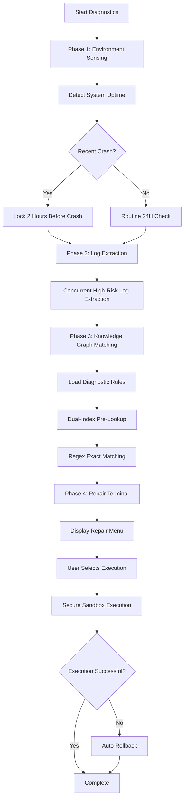

# AURORA Analyzer - Windows Event Log Export and Smart Diagnostics Tool

**Version:** V1.1.23.0  
**Build Date:** 2026.05.19  
**Author:** AURORA VelociRaptor-GR Dev PRJ.  
**License:** For personal learning and research use only

---

## 📖 Table of Contents

1. [Product Overview](#-product-overview)
2. [Core Features](#-core-features)
3. [System Architecture](#-system-architecture)
4. [Technical Specifications](#-technical-specifications)
5. [Quick Start](#-quick-start)
6. [PRO Mode Guide](#-pro-mode-guide)
7. [Smart Diagnostics Engine](#-smart-diagnostics-engine)
8. [Phase 4.2 Undo Support System](#-phase-42-undo-support-system)
9. [Phase 5 Animation Engine](#-phase-5-animation-engine)
10. [Developer Guide](#-developer-guide)
11. [FAQ](#-faq)
12. [Version History](#-version-history)

---

## 📌 Product Overview

AURORA Analyzer is a professional Windows system event log export and smart diagnostics tool, integrating advanced log analysis, knowledge base matching, autonomous repair suggestions, and other powerful features.

### Key Features

- **Bilingual Support**: Complete Chinese/English bilingual interface
- **PRO Mode**: Professional-level log export and analysis
- **Smart Diagnostics**: Automatic problem identification based on knowledge graph
- **Secure Repair**: Repair operations with system restore points and fast backups
- **Modern GUI**: High-performance Windows Forms graphical interface
- **Session Persistence**: Supports breakpoint resume and progress saving

### Application Scenarios

- System troubleshooting and root cause analysis
- Blue screen/unexpected shutdown diagnostics
- Driver conflict detection
- System health status assessment
- Enterprise IT operations automation

---

## 🚀 Core Features

### 1. PRO Mode - Advanced Log Export

**Supported Log Types:**
- System
- Application
- Security (requires administrator privileges)
- Setup
- DNS Server
- DHCP Server
- Directory Service
- IIS Admin Service

**Export Modes:**
- Single Day Export: Quickly export logs for a specific date
- Date Range Export: Support batch export across multiple dates
- Custom Filtering: Filter by EventID, Provider, Level, and other conditions

### 2. Smart Diagnostics Engine (SmartEngine)

**Core Capabilities:**
- Automatic analysis of system uptime and crash history
- Targeted locking of abnormal time periods (2 hours before crash/4 hours after boot)
- Automatic Minidump blue screen dump file analysis
- Knowledge graph rule matching (supports 100+ diagnostic rules)
- Autonomous repair suggestions and one-click execution

**Diagnostic Rule Categories:**
- Category A: System Stability (unexpected shutdowns, blue screens)
- Category B: Application Errors
- Category C: Driver Issues
- Category D: Hardware Fault Warnings
- Category E: Security Event Auditing

### 3. Secure Repair Sandbox (Phase 4.2)

**Undo Support System:**
- **System Restore Points**: Using Windows System Restore API
- **Fast Backup Snapshots**: Quick backups of registry/files/service configurations
- **Repair Session Logs**: Complete audit trail of repair operations
- **One-Click Undo**: Supports quick rollback of repair operations

**Secure Execution Flow:**
```
Pre-Check → Create Restore Point → Create Backup Snapshot → Execute Repair → Verify Results → (Auto Rollback on Failure)
```

### 4. Modern GUI Interface

**Technical Features:**
- Borderless window design + custom dragging
- Aurora progress bar (glow animation + particle system)
- Starfield background status panel
- Real-time log output and progress display
- Holographic dialog interaction

**Performance Tiers:**
- Extreme: 8-core+ 32GB+
- Performance: 6-core 16GB
- Balanced: 4-core 8GB
- Eco: Legacy devices

---

## 🏗️ System Architecture

### Directory Structure

```
AURORA-Analyzer-Factory/
├── AURORA.Launcher-双击启动.exe    # Main launcher (password-free startup)
├── GAURORA.CHK.ENC                 # Encrypted verification file
├── version.txt                     # Version information
├── desktop.ini                     # Folder customization
│
├── Scripts/                        # Core scripts directory
│   ├── AURORA-AnalyzerLauncherGUI.ps1      # Main GUI launcher
│   ├── AURORA-AnalyzerPRO.ps1              # PRO mode unified entry
│   ├── AURORA-AnalyzerCHSPRO.ps1           # Chinese Professional Edition Engine
│   ├── AURORA-AnalyzerENGPRO.ps1           # English Professional Edition Engine
│   ├── AURORA-SmartEngine.ps1              # Smart diagnostics engine
│   ├── AURORA-CoreEngine.ps1               # Shared core engine
│   ├── AURORA-GUI-Functions.ps1            # GUI helper functions
│   ├── AURORA-Language.psd1                # Bilingual resource pack
│   ├── AURORA-ProgressManager.ps1          # Progress manager
│   ├── AURORA-ProgressManager-Integration-CHS.ps1
│   ├── AURORA-ProgressManager-Integration-ENG.ps1
│   ├── AURORA-ProgressManager-Integration.ps1
│   │
│   ├── Phase 4.2 Undo Support Modules
│   ├── AURORA-RestoreManager.ps1           # System restore manager
│   ├── AURORA-RepairLogger.ps1             # Repair logger
│   ├── AURORA-UndoManager.ps1              # Fast backup & restore
│   ├── AURORA-RepairTools.ps1              # Repair tools entry
│   └── AURORA-UndoViewer.ps1               # Undo manager viewer
│   │
│   └── Core/
│       └── AURORA-AnimationCoreEngine.ps1  # Animation core engine
│
├── Data/                           # Data directory
│   ├── AURORA-TechData.json        # Technical knowledge base (diagnostic rules)
│   └── AURORA-TechData.cache.clixml # Knowledge base cache
│
├── Resources/                      # Resource directory
│   ├── AURORAICON.ico              # Application icon
│   └── CascadiaMono.ttf            # Monospace font (UI beautification)
│
├── UserLogs/                       # User log output directory
│   └── *.csv, *.json, *.xml, *.txt # Exported log files
│
└── build.ps1                       # PowerShell build script
    AURORA-build.bat                # Batch build tool
```

### Core Components

| Component Name | File Size | Description |
|---------------|-----------|-------------|
| AURORA.Launcher-双击启动.exe | ~50KB | C# compiled windowless launcher, responsible for integrity verification |
| AURORA-AnalyzerLauncherGUI.ps1 | ~10,000 lines | Main GUI interface, responsible for task management and user interaction |
| AURORA-AnalyzerPRO.ps1 | ~200 lines | PRO mode unified entry, distributes based on language parameter |
| AURORA-AnalyzerCHSPRO.ps1 | ~7,767 lines | Chinese Professional Edition log export engine |
| AURORA-AnalyzerENGPRO.ps1 | ~7,500 lines | English Professional Edition log export engine |
| AURORA-SmartEngine.ps1 | ~1,500 lines | Smart diagnostics and autonomous repair engine |
| AURORA-CoreEngine.ps1 | ~500 lines | Core functions shared by CHSPRO/ENGPRO |
| AURORA-GUI-Functions.ps1 | ~220 lines | GUI helper functions (fonts, directory detection, etc.) |
| AURORA-AnimationCoreEngine.ps1 | ~800 lines | Animation rendering engine (progress bar, particle system) |

---

## 📊 Technical Specifications

### System Requirements

**Minimum Configuration:**
- Windows 10/11 (64-bit)
- PowerShell 5.1 or higher
- .NET Framework 4.0+
- 50MB available disk space

**Recommended Configuration:**
- Windows 11 (22H2 or later)
- 8GB+ RAM
- 4-core CPU
- SSD storage

### Security

**Encryption & Verification:**
- AES-256-CBC encrypted check file
- SHA256 file integrity verification
- Password strength policy (8+ chars, uppercase, lowercase, numbers, special characters)

**Permission Management:**
- Standard user mode (default)
- Administrator elevation mode (Security logs/System Restore)
- Interactive authorization confirmation

### Performance Metrics

**Log Export Speed:**
- System logs (24 hours): ~5-10 seconds
- Application logs (24 hours): ~3-8 seconds
- Security logs (24 hours): ~10-20 seconds

**Smart Diagnostics Speed:**
- Knowledge graph loading: ~0.5-2 seconds (cache hit)
- Rule matching: ~1-3 seconds (100,000 events)
- Minidump analysis: ~0.1-0.5 seconds/file

---

## 🎯 Quick Start

### Method 1: EXE Launcher (Recommended)

```bash
# Double-click to run
AURORA.Launcher-双击启动.exe
```

**Advantages:**
- No password verification required
- Automatic integrity check
- Hidden PowerShell window

### Method 2: PowerShell Direct Launch

```powershell
# Navigate to project root directory
cd AURORA-Analyzer-Factory

# Run GUI script
.\Scripts\AURORA-AnalyzerLauncherGUI.ps1
```

**Note:** Direct launch requires entering the startup password (set by the builder)

### Method 3: Batch Build Tool

```batch
# View help
AURORA-build.bat /help

# Start build
AURORA-build.bat /generate
```

**Features:**
- Automatic version management
- Password strength check
- Encrypted file generation
- C# launcher compilation
- Automatic ZIP packaging

---

## 🔧 PRO Mode Guide

### Usage Flow

1. **Select Log Type**
   - Standard Mode: System + Application (default)
   - Extended Mode: Security/Setup/DNS/DHCP/AD/IIS

2. **Select Date Range**
   - Single Day Export: Quick export for a specific date
   - Date Range: Batch export for multiple days

3. **Set Filter Conditions** (Optional)
   - EventID filter
   - Provider filter
   - Log level (Critical/Error/Warning)

4. **Start Export**
   - Automatically generates CSV + JSON + XML formats
   - Generates summary report and trend analysis

### Output Files

**Main Log Files:**
- `系统_日志_YYYYMMDD___YYYYMMDD.csv` - CSV format
- `系统_日志_YYYYMMDD___YYYYMMDD.json` - JSON format
- `系统_日志_YYYYMMDD___YYYYMMDD.xml` - XML format
- `系统_日志_YYYYMMDD___YYYYMMDD_摘要.txt` - Text summary

**Analysis Files:**
- `系统_日志_YYYYMMDD_至_YYYYMMDD_趋势分析.txt` - Trend analysis report
- `系统_日志_YYYYMMDD_至_YYYYMMDD_趋势数据.csv` - Trend data

---

## 🤖 Smart Diagnostics Engine

### Working Principle



### Minidump Analysis

**Supported BugCheck Codes:**
- 0x0000000A: IRQL_NOT_LESS_OR_EQUAL
- 0x0000001E: KMODE_EXCEPTION_NOT_HANDLED
- 0x0000003B: SYSTEM_SERVICE_EXCEPTION
- 0x0000007E: SYSTEM_THREAD_EXCEPTION_NOT_HANDLED
- 0x00000116: VIDEO_TDR_ERROR
- 0x00000124: WHEA_UNCORRECTABLE_ERROR
- 0x00000133: DPC_WATCHDOG_VIOLATION
- ... (supports 20+ common blue screen codes)

**Analysis Content:**
- BugCheck code and parameters
- Possible fault causes
- Recommended solutions

---

## 🔄 Phase 4.2 Undo Support System

### System Restore Point Management

**Features:**
- Create system restore points (Windows System Restore)
- Query available restore point list
- Delete outdated restore points
- Execute system restore (requires restart)

**API Calls:**
```powershell
# Create restore point
Create-SystemRestorePoint -Description "AURORA Before Repair"

# Query restore points
Get-SystemRestorePoints

# Delete restore point
Remove-SystemRestorePoint -SequenceNumber 45
```

### Fast Backup Snapshot

**Supported Types:**
- Registry: Registry key export (.reg file)
- File: File backup
- Service: Service configuration export (JSON)
- Mixed: Mixed type backup

**Creating Snapshots:**
```powershell
# Backup registry
Create-BackupSnapshot -Type "Registry" -Paths @("HKLM:\SOFTWARE\Policies\Microsoft\Windows\WindowsUpdate")

# Backup files
Create-BackupSnapshot -Type "File" -Paths @("C:\Windows\System32\config\SOFTWARE")

# Backup service configuration
Create-BackupSnapshot -Type "Service" -ServiceNames @("wuauserv", "BITS")
```

### Repair Session Logs

**Session Information:**
- Session ID: Unique identifier
- Start/Complete time
- Repair type and target
- List of executed commands
- Restore point/backup snapshot ID
- Undoable status flag

**Query History:**
```powershell
# Get session
Get-RepairSession -SessionId "RS_20260519_123456_789"

# List all sessions
Get-RepairSession -All
```

---

## ✨ Phase 5 Animation Engine

### AURORA-AnimationCoreEngine

**Core Classes:**
- `AuroraProgressBar`: Progress bar with glow animation
- `StarfieldPanel`: Starfield background panel
- `TechButton`: Dynamic button control
- `AURORA_Animation`: Global animation manager

**Animation Features:**
- Glow sweep effect (PathGradientBrush)
- Particle system (lifecycle + random drift)
- Double-buffered rendering (anti-flicker)
- Performance adaptive (adjusted based on hardware tier)

**Performance Tier Logic:**
```powershell
# Performance scoring algorithm
$perfScore = ($logicalCores * 15) + ($ramGB * 5) + ([Math]::Max(0, ($baseClock - 2000) / 100))

if ($perfScore -ge 240) { $tier = "Extreme" }      # 8-core+ 32GB+
elseif ($perfScore -ge 120) { $tier = "Performance" } # 6-core 16GB
elseif ($perfScore -ge 70) { $tier = "Balanced" }     # 4-core 8GB
else { $tier = "Eco" }                                # Legacy devices
```

---

## 👨‍💻 Developer Guide

### Build Process

**Prerequisites:**
- Windows 10/11
- PowerShell 5.1+
- .NET Framework 4.0+ (csc.exe)
- 7-Zip or Windows built-in ZIP support

**Steps:**

1. **Prepare Password**
   ```
   Requirements: 8+ characters, including uppercase, lowercase, numbers, special characters
   Example: Aurora@2026!
   ```

2. **Run Build Script**
   ```powershell
   # Method 1: Use batch tool
   .\AURORA-build.bat /generate
   
   # Method 2: Run PowerShell script directly
   .\build.ps1
   ```

3. **Enter Password**
   - Build process will prompt for master password
   - Password is used to encrypt check file
   - Password strength is automatically checked

4. **Select Build Options**
   ```
   1. Build with current version
   2. Increment version and build
   ```

5. **Automatic Packaging (Optional)**
   - Ask whether to create ZIP release package
   - ZIP filename: `AURORA_Analyzer_v1.1.23.0_Release.zip`

### Code Structure

**Naming Conventions:**
- Script files: `AURORA-ModuleName.ps1`
- Function naming: `Verb-Noun` (e.g., `Create-BackupSnapshot`)
- Variable naming: `$camelCase` (local), `$global:syncHash` (global)

**Language Resources:**
```powershell
# Import language pack
$langResource = Import-LocalizedData -FileName "AURORA-Language.psd1"
$L = $langResource[$Language]

# Usage example
Write-Host $L["Launcher_Required"]
```

### Testing & Debugging

**Unit Test Scripts:**
- `Test-ProgressManager.ps1` - Progress manager test
- `Test-Bilingual.ps1` - Bilingual support test
- `Test-UndoBackup.ps1` - Undo backup test
- `Test-RealBackup.ps1` - Real backup test

**Debugging Mode:**
```powershell
# Enable verbose logging
$VerbosePreference = "Continue"

# Enable debug output
$DebugPreference = "Continue"

# Capture error details
try {
    # Code
} catch {
    Write-Host "Error: $($_.Exception.Message)" -ForegroundColor Red
    Write-Host "StackTrace: $($_.ScriptStackTrace)" -ForegroundColor Yellow
}
```

---

## ❓ FAQ

### Q1: "Incorrect Password" Prompt on Startup

**Reason:** Password verification is required when running GUI script directly

**Solution:**
- Use EXE launcher (`AURORA.Launcher-双击启动.exe`) to skip password
- Or contact the builder for the password

### Q2: Security Log Export Failed

**Reason:** Security logs require administrator privileges

**Solution:**
- Right-click EXE launcher and select "Run as administrator"
- Or authorize elevation in GUI

### Q3: Smart Diagnostics Found No Issues

**Reasons:**
- System is indeed healthy, no rules matched
- Log time range set improperly
- Knowledge base version is outdated

**Solutions:**
- Try expanding time range (e.g., 7 days)
- Manually check Windows Reliability Monitor
- Update AURORA-TechData.json

### Q4: System Restore Point Creation Failed

**Reasons:**
- Not running as administrator
- System Restore feature is disabled
- Insufficient disk space

**Solutions:**
- Run as administrator
- Enable System Restore: System Properties → System Protection → Enable
- Clean up disk space

### Q5: GUI Display Abnormalities

**Reasons:**
- DPI scaling issues
- Missing font files
- .NET Framework version too low

**Solutions:**
- Update Windows and .NET Framework
- Check if `Resources\CascadiaMono.ttf` exists
- Try reducing DPI scaling ratio

---

## 📜 Version History

### V1.1.23.0 (Current Version)

**New Features:**
- ✅ Complete bilingual support (Chinese/English)
- ✅ Phase 4.2 Undo Support System
- ✅ Phase 5 Animation Engine Decoupling
- ✅ Automatic Minidump blue screen file analysis
- ✅ Knowledge base cache mechanism (CliXML serialization)

**Improvements:**
- 🚀 Performance optimization: Dual-index pre-lookup + candidate set exact matching
- 🛡️ Security enhancement: Pre-check + risk assessment + rollback mechanism
- 🎨 UI beautification: Folder icon + desktop.ini configuration
- 📦 Build optimization: Automatic ZIP packaging + version management

**Bug Fixes:**
- 🐛 Fixed GUI authorization polling CPU usage (switched to EventWaitHandle)
- 🐛 Fixed PRO mode CSV reading field name error
- 🐛 Fixed Undo backup metadata saving issue

### V1.1.22.0

- Added progress manager (breakpoint resume)
- Added multi-log type support
- Optimized log export performance

### V1.1.0Release

- Initial public release version
- Basic log export functionality
- Smart diagnostics engine v1.0

---

## 📞 Technical Support

**Document Version:** V1.1.23.0  
**Last Updated:** 2026.05.19  
**Author:** AURORA VelociRaptor-GR Dev PRJ.

**Contact Information:**
- Project Homepage: [To be added]
- Issue Reporting: [To be added]
- Development Documentation: See project Wiki

**License:**
- This tool is for personal learning and research use only
- Commercial use is prohibited
- All rights reserved

---

## 🙏 Acknowledgments

Thanks to all developers and testers who have contributed to the AURORA project!

**Special Thanks:**
- Microsoft Docs - Windows Event Log documentation
- PowerShell Community - Best practice guidance
- Test volunteers - Feedback and suggestions

---

*Last updated: 2026.05.19*
